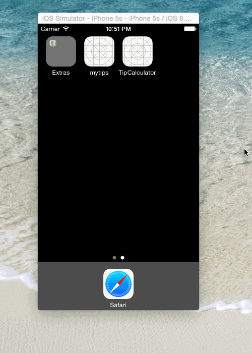

# PreWorkApp
This is the Swift version of Tip Calculator Application.

Time spent: 2 hours spent in total

Completed user stories:

Required: User can calculate tips. 
Required: User can select the Settings button to bring up a Settings menu.
Optional: User can select a light/dark color theme in the Settings view.
Optional: User can configure the default tip percentage.

Walkthrough of all user stories:

GIF created with <a href="http://www.cockos.com/licecap/">LiceCap</a>.

